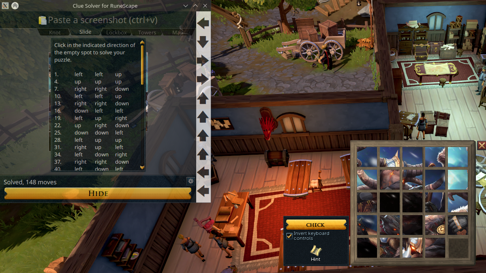
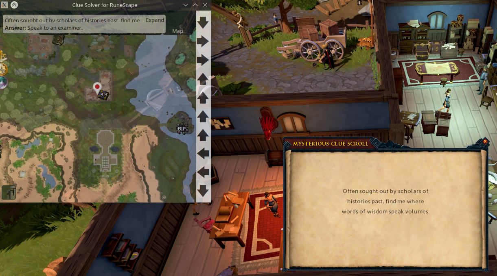

# Clue Solver for RuneScape

A Linux-compatible wrapper for the [RuneApps](https://runeapps.org) treasure trail clue solver.

### How to use

Run `mirror.py` then compile and run `Main.kt`. Press <kbd>Alt + 1</kbd> to send a screenshot of the game to the
embedded browser and a solution should appear. For slider puzzles you must set the guide _Output type_ to _Instruction
list_. If the solution does not appear, try pressing the Hide/Guide button. If you messed up, just press <kbd>Alt +
1</kbd> again to re-solve it.

### Known Issues

- JavaFX WebView doesn't render the .webp map tiles properly so currently I'm using a mirror server that converts them
  to PNG before serving them. The application points to the mirror server address at http://localhost:8811 so you need
  to run `python mirror.py` in order to use the app.
- You cannot open the map settings, you must edit the JSON loaded by `setupLocalStorage()` directly.
